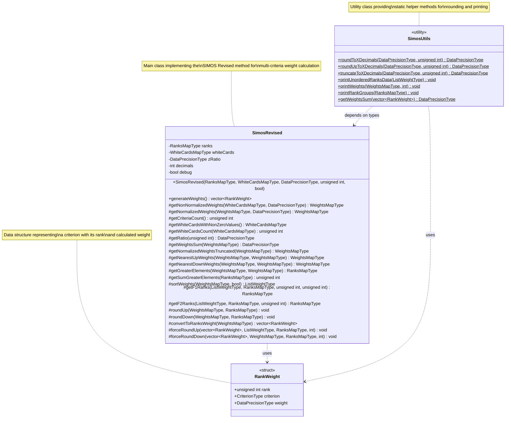

# UML Class Diagram

This diagram shows the class structure of the SIMOS Revised weight calculation system.

## Type Definitions

The following type aliases are used throughout the system:

- **DataPrecisionType**: `double` - Precision type for weight calculations
- **CriterionType**: `std::string` - Type for criterion identifiers
- **RankGroupType**: `std::vector<CriterionType>` - Group of criteria at the same rank
- **RanksMapType**: `std::map<unsigned int, RankGroupType>` - Map of rank to criteria groups
- **WhiteCardsMapType**: `std::map<unsigned int, unsigned int>` - Map of white cards per rank
- **WeightsMapType**: `std::map<unsigned int, DataPrecisionType>` - Map of criterion ID to weight
- **ListWeightType**: `std::vector<std::pair<unsigned int, DataPrecisionType>>` - List of ID-weight pairs

## Relationships

- **SimosRevised** uses **RankWeight** as return type for `generateWeights()`
- **SimosUtils** depends on types defined in SimosRevised header
- **SimosUtils** provides static utility methods for both **SimosRevised** and **RankWeight**
