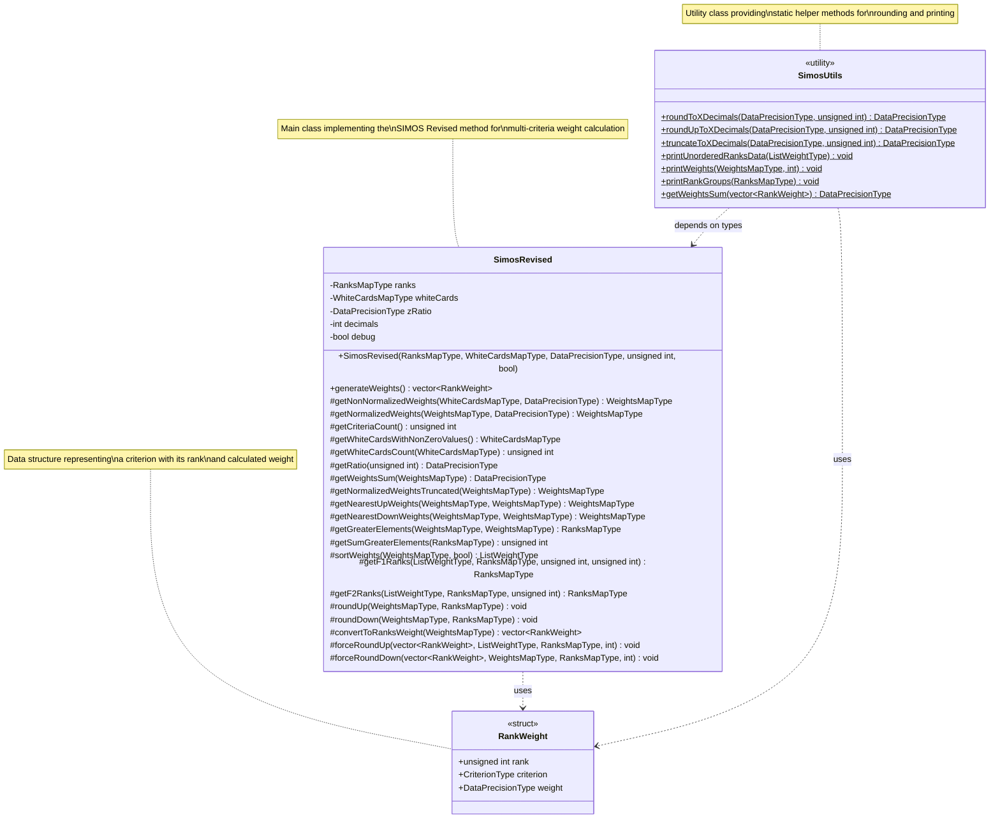

# SIMOS Revised Diagrams

This document contains the class and sequence diagrams for the SIMOS Revised weight calculation system.

## Class Diagram

The class diagram shows the structure of the main classes and their relationships.

### Type Definitions

The following type aliases are used throughout the system:

- **DataPrecisionType**: `double` - Precision type for weight calculations
- **CriterionType**: `std::string` - Type for criterion identifiers
- **RankGroupType**: `std::vector<CriterionType>` - Group of criteria at the same rank
- **RanksMapType**: `std::map<unsigned int, RankGroupType>` - Map of rank to criteria groups
- **WhiteCardsMapType**: `std::map<unsigned int, unsigned int>` - Map of white cards per rank
- **WeightsMapType**: `std::map<unsigned int, DataPrecisionType>` - Map of criterion ID to weight
- **ListWeightType**: `std::vector<std::pair<unsigned int, DataPrecisionType>>` - List of ID-weight pairs

### Relationships

- **SimosRevised** uses **RankWeight** as return type for `generateWeights()`
- **SimosUtils** depends on types defined in SimosRevised header
- **SimosUtils** provides static utility methods for both **SimosRevised** and **RankWeight**

---

## Sequence Diagram

The sequence diagram illustrates the complete algorithm flow for generating weights using the SIMOS Revised method.

```mermaid
sequenceDiagram
    participant User
    participant SimosRevised
    participant SimosUtils
    
    User->>+SimosRevised: generateWeights()
    
    Note over SimosRevised: Step 1: Process White Cards
    SimosRevised->>SimosRevised: getWhiteCardsWithNonZeroValues()
    Note right of SimosRevised: Convert e'_r to e_r = e'_r + 1
    
    SimosRevised->>SimosRevised: getWhiteCardsCount()
    Note right of SimosRevised: Sum all white card intervals
    
    SimosRevised->>SimosRevised: getRatio(whiteCardsCount)
    Note right of SimosRevised: Calculate u = (z-1)/e
    
    Note over SimosRevised: Step 2: Calculate Non-Normalized Weights
    SimosRevised->>SimosRevised: getNonNormalizedWeights(whiteCards, ratio)
    Note right of SimosRevised: k(r) = 1 + u(e_0 + ... + e_{r-1})
    
    SimosRevised->>SimosRevised: getWeightsSum(nonNormalizedWeights)
    Note right of SimosRevised: Sum K' = Σk(r)
    
    Note over SimosRevised: Step 3: Normalize to 100
    SimosRevised->>SimosRevised: getNormalizedWeights(weights, sum)
    Note right of SimosRevised: k_i = 100 * k'_i / K'
    
    Note over SimosRevised: Step 4: Truncate to Decimal Places
    SimosRevised->>SimosRevised: getNormalizedWeightsTruncated(weights)
    SimosRevised->>+SimosUtils: truncateToXDecimals(value, decimals)
    SimosUtils-->>-SimosRevised: truncated value
    Note right of SimosRevised: k''_i with w decimal places
    
    SimosRevised->>SimosRevised: getWeightsSum(truncated)
    Note right of SimosRevised: Calculate Δ = 100 - K''<br/>m = 10^w * Δ
    
    Note over SimosRevised: Step 5: Calculate Dysfunction Ratios
    SimosRevised->>SimosRevised: getNearestUpWeights(normalized, truncated)
    Note right of SimosRevised: δ'_i = [10^-w - (k_i - k''_i)] / k_i
    
    SimosRevised->>SimosRevised: getNearestDownWeights(normalized, truncated)
    Note right of SimosRevised: δ_i = (k_i - k''_i) / k_i
    
    Note over SimosRevised: Step 6: Identify Set M
    SimosRevised->>SimosRevised: getGreaterElements(d1, d2)
    Note right of SimosRevised: M = {i | δ'_i > δ_i}<br/>Round down is better
    
    SimosRevised->>SimosRevised: getSumGreaterElements(M)
    SimosRevised->>SimosRevised: sortWeights(d1, asc=true)
    SimosRevised->>SimosRevised: sortWeights(d2, asc=false)
    SimosRevised->>SimosRevised: getCriteriaCount()
    
    Note over SimosRevised: Step 7: Partition into F+ and F-
    alt Case (a): m + m̄ ≤ n
        SimosRevised->>SimosRevised: getF1Ranks(sortedD2, M, params)
        Note right of SimosRevised: Build F- (round down)
        SimosRevised->>SimosRevised: getF2Ranks(sortedD2, M, total)
        Note right of SimosRevised: Build F+ (round up)
    else Case (b): m + m̄ > n
        SimosRevised->>SimosRevised: getF1Ranks(sortedD1, M, params)
        Note right of SimosRevised: Build F- (round down)
        SimosRevised->>SimosRevised: getF2Ranks(sortedD1, M, total)
        Note right of SimosRevised: Build F+ (round up)
    end
    
    opt Debug Mode
        SimosRevised->>+SimosUtils: printWeights(weights)
        SimosUtils-->>-SimosRevised: printed
        SimosRevised->>+SimosUtils: printRankGroups(ranks)
        SimosUtils-->>-SimosRevised: printed
    end
    
    Note over SimosRevised: Step 8: Apply Rounding
    SimosRevised->>SimosRevised: roundUp(weights, F2)
    SimosRevised->>+SimosUtils: roundUpToXDecimals(weight, decimals)
    SimosUtils-->>-SimosRevised: rounded up
    
    SimosRevised->>SimosRevised: roundDown(weights, F1)
    SimosRevised->>+SimosUtils: truncateToXDecimals(weight, decimals)
    SimosUtils-->>-SimosRevised: truncated
    
    Note over SimosRevised: Step 9: Convert to Final Format
    SimosRevised->>SimosRevised: convertToRanksWeight(weights)
    Note right of SimosRevised: Map → vector<RankWeight>
    
    Note over SimosRevised: Step 10: Handle Ex Aequo Criteria
    opt forcedTotalElements > 0
        SimosRevised->>SimosRevised: forceRoundUp(finalWeights, sorted, M, forced)
        SimosRevised->>+SimosUtils: roundUpToXDecimals(weight, decimals)
        SimosUtils-->>-SimosRevised: rounded up
        Note right of SimosRevised: Handle tied criteria<br/>needing round up
    end
    
    opt forcedDownElements > 0
        SimosRevised->>SimosRevised: forceRoundDown(finalWeights, weights, F2, forced)
        SimosRevised->>+SimosUtils: truncateToXDecimals(weight, decimals)
        SimosUtils-->>-SimosRevised: truncated
        Note right of SimosRevised: Handle tied criteria<br/>needing round down
    end
    
    SimosRevised-->>-User: vector<RankWeight>
    Note over User: Final weights sum to 100<br/>with w decimal places
```

### Algorithm Steps Overview

1. **Process White Cards**: Convert and sum white card intervals
2. **Calculate Non-Normalized Weights**: Apply the base formula with ratio
3. **Normalize to 100**: Scale weights to sum to 100
4. **Truncate to Decimal Places**: Apply precision constraints
5. **Calculate Dysfunction Ratios**: Determine rounding impact
6. **Identify Set M**: Find criteria better suited for rounding down
7. **Partition into F+ and F-**: Allocate criteria to rounding sets
8. **Apply Rounding**: Execute the rounding strategy
9. **Convert to Final Format**: Transform to output structure
10. **Handle Ex Aequo Criteria**: Address tied rankings with forced rounding
